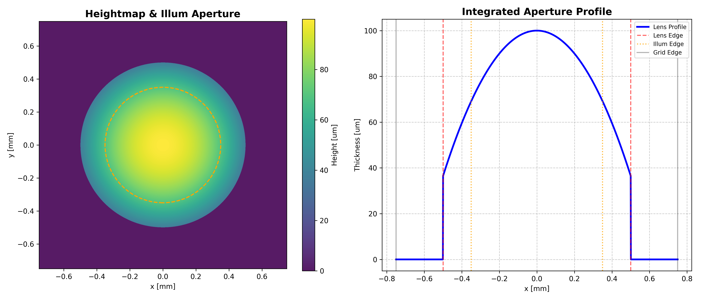
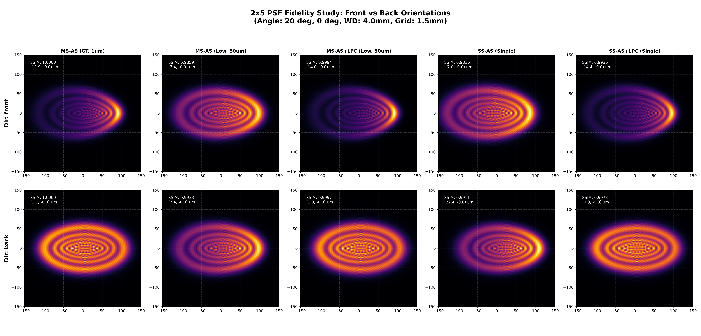

# Geometry-Aware Phase Compensation for Sampling-Efficient Angular Spectrum Method

Official demo for **Geometry-Aware Phase Compensation (GPC)** techniques designed for sampling-efficient Angular Spectrum Method (ASM) propagation in thick optical systems.

##  Overview

This repository demonstrates a computationally efficient methodology for simulating light propagation through thick refractive elements (e.g., lenslets, micro-optics) at high incident angles. 

Traditional single-step ASM often suffers from numerical instability and phase errors when dealing with geometric thickness. Our approach introduces:
- **Global Phase Correction (GPC)**: Accounting for the bulk phase evolution through the material.
- **Local Phase Correction (LPC)**: An advanced coordinate-skewing technique that preserves the optical path accuracy by accounting for local ray-slanting within the material.




##  Features

- **Multi-Slice ASM (MS-AS)**: A high-fidelity benchmark that slices the optical element into thin layers to minimize propagation error.
- **Single-Slice ASM (SS-AS)**: An ultra-efficient model utilizing GPC and LPC to achieve benchmark-level fidelity in a single axial step.
- **2x5 PSF Matrix**: Automated visualization comparing 5 simulation variants across both **Front** (curved first) and **Back** (flat first) lens orientations.
- **Quantitative Metrics**: Integrated MS-SSIM and Centroid (µm) calculation for quantitative fidelity verification.


##  Requirements

The simulation is built using **PyTorch** for GPU acceleration and automatic differentiation compatibility.


- **Python**: 3.8+
- **CUDA**: Recommended for larger grid sizes (e.g., 1500x1500px).

##  Usage

To run the full PSF fidelity study and generate the result visualizations:

```bash
python optical_demo_main.py
```

### Simulation Parameters
You can adjust the following parameters in `optical_demo_main.py`:
- `PxSize`: Spatial sampling resolution (default: 1.0µm).
- `Grid_Window`: Spatial domain size (default: 1.5mm).
- `WD`: Distance from the lens to the sensor (Working Distance).
- `Lens_Dia`: Lens Diameter (default: 1.0  * mm)
- `ROC`: Radius of curvature of the lens (default: 2.0mm).
- `lens_thick`: Thickness of the lens (default: 100µm).
- `n_mat`: Refractive index of the lens (default: 1.54).
- `n_bkgd`: Refractive index of the background (default: 1.0).
- `Illum_Dia`: Diameter of the illumination aperture (default: 0.7mm).
- `wavelength`: Wavelength of the light (default: 550nm).
- `angle_deg_x`: Incident wave angle in degrees (default: 20).
- `angle_deg_y`: Incident wave angle in degrees (default: 0).
- `dz_gt`: Ground truth propagation distance (default: 1.0µm).
- `dz_coarse`: Coarse propagation distance (default: 50.0µm).
- `Crop_window`: Region of interest for analysis.

##  Project Structure

- `optical_demo_main.py`: Main orchestration script for simulation, metric calculation, and visualization.
- `optical_demo_utils.py`: Core physics engine containing MS-AS, SS-AS, and GPC/LPC implementations.

---
**Imaging Intelligence Lab, SNU** | 2026. 02. 24
